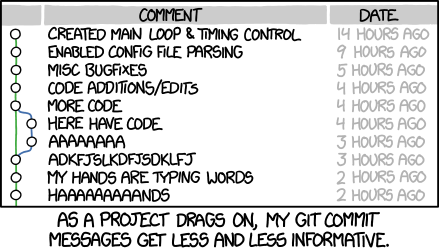
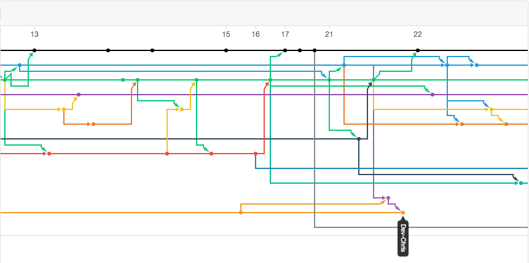

---
title: "GitHub Lab"
author: "Mackenzie Gray, Adriana Souza"
date: "February 8th, 2018"
output:
  html_document:
    df_print: paged
    toc: yes
  html_notebook:
    highlight: tango
    mathjax: null
    number_sections: yes
    theme: spacelab
    toc: yes
    toc_float: yes
  pdf_document:
    toc: yes
---  


# What is Git?

Git is a __version control system__. Version control is a system that records changes to a file or set of files
over time so that you can recall specific versions later. 

# Why should I use it?

1. __Version Control__

Imagine you are working on a project and you make a mistake after you've been working on your code for a while. With version control, you can rollback your code to a previous version that worked better.

2. __Backup__ 

Your versions are not only stored locally but also remotely. If you lose your personal computer, you will have a backup of the files for which you created repositories.

3. __Sharing and ease of collaboration__

If you need to collaborate on data analysis or code development, then you and your team should use Git. Use GitHub as your clearinghouse: individuals work independently then send work back to GitHub for reconciliation and transmission to the rest of the team.

4. __Exposure:__ 

If someone needs to see your work or if you want them to try out your code, they can easily get it from GitHub. If they use Git, they can clone or fork your repository. If they don’t use Git, they can still browse your project on GitHub like a normal website and even grab everything by downloading a zip archive.

# How can I integrate it into R-studio?

What you need:

1. Having Git installed on your machine. If you don't, check out [this guide](https://git-scm.com/book/en/v2/Getting-Started-Installing-Git).

2. Your account to GitHub.

3. RStudio

## Getting started

### Make a repository 

In general, on your GitHub account you would create a new repository and give it a name. For this lab however, the repository you will use is the forked repo for each row.


1. __Public vs. Private:__ If you are using a regular free account, your repositories will be public. A good way around this is to use a [GitHub education account](https://education.github.com). 

2. __README.md:__ Text that will show up when people click your repository. This should be a description of what people can find there and instructions on how to use it, for example.

3. __.gitignore files:__ .gitignore tells Git which files (or patterns) it should ignore. It's usually used to avoid committing transient files from your working directory that aren't useful to other collaborators, such as compilation products, temporary files IDEs create, large datasets etc. It is also good for passwords and security too. More details
[here](https://git-scm.com/docs/gitignore). GitHub has created a [collection](https://github.com/github/gitignore) of .gitignore files for lots and lots of different languages, which are great as a starting point.

4. __License:__ You do not have to use one but, for future reference, the MIT License is a good way to go. The MIT License is a permissive license that is short and to the point. It lets people do anything they want with your code as long as they provide attribution back to you and don’t hold you liable. Need help picking a license? Try [this page](https://choosealicense.com).


### Making a git-enabled project in RStudio

1. In RStudio under `File`, click `New Project`. 

2. When prompted, choose the third option down called `Version Control`.

3. Then click the `Git` option.

4. A window will appear that asks you to clone the Git Repository. You can get the url from the big green button that says `Clone or Download` somewhere on the right of your repository page on GitHub. Copy and paste that link in the first field. This should populate the second field according to the repository's name but you can change it to whatever you'd like. You can also change where this will be stored in the third field.

    + __Clone your group's repository.__


### Make changes: Commit, Pull, Push

When you created your project, a tab called `Git` was added to your `Environment` pane, usually found in the upper right corner of your RStudio window. 

In the `Git` tab, you can see all the files in your project. The `.rmd` file you are editing, the `.proj` file for your project, and here we also see a `.PNG` file for the image that we added to the top of this notebook. These are all the files that will be in your remote repository, but how do we get them there?

For that, take a look at the options `Diff`, `Commit`, `Pull`, `Push`, `History`, `More`, `New Branch` and, in this case, because we created the repository, `master`.


#### Staging {-}

Git keeps track of changes to tracked files in the background. These changes must be `stage`d before they can be committed. In RStudio, this is done using the checkboxes next to each file in the Git pane.

1. __Edit this file and stage the changes, but do not commit your changes.__

Ha ha, you nerds, I just made a merge conflict. Good luck.

#### Diff {-}

[`diff`](https://git-scm.com/docs/git-diff) shows changes between commits, commit and working tree, or changes between two files on disk, etc. This allows for a fine-grained approach to stage or unstage specific changes by chunk or line.

1. __Click `diff` and view the changes you made, but do not commit anything.__


#### Commit {-}

[`commit`](https://git-scm.com/docs/git-commit) records staged changes to the repository. You choose the files where you made changes and add a message describing those changes. You do not have to add a message, but you will thank yourself later. 

Using the form

```
<Short message describing changes briefly>

- <Longer description if desired>
```

for commit messages allows git/GitHub to show the shorter message attached to each commit while allowing one to view a longer description of the changes made if needed.



1. __Commit the changes you made earlier. Use a good message that explains what you changed.__

##### When should I commit changes? {-}

Good question. Essentially, as often as makes sense. In theory, each commit should be one functional change (ie. it's somewhat bad form for a commit message to be "Adds plots and improves efficiency and removes remote file sharing and..."). This allows one to step through changes in a fine-grained fashion to identify and solve issues later down the line, while large changes make this much more difficult and actually work against the point of using Git.

##### What if I make a mistake? {-}

Well, you're in luck. If you commit something but realise there's a typo, or you didn't include a file, you can stage those changes and amend the previous commit---as long as you didn't push the changes. If you did, you'll need to break out the command line to amend them, so it's probably easier to just create a new commmit.

#### Pull {-}

[`pull`](https://git-scm.com/docs/git-pull) is what you do to bring a local branch up-to-date with its remote version, while also updating your other remote-tracking branches. This is where you run into the most issues with merge conflicts. Unfortunately, this is a thorny and detailed issue that is too time intensive to be covered here in too much depth.

#### Push {-}

[`push`](https://git-scm.com/docs/git-push)  transfers the last commit(s) to a remote server. It is possible to set up multiple remote destinations, but dealing with that is unnecessary unless you know you need it.

1. __One person should push their changes. The rest of the group should then pull those changes in.__

2. __If there are any merge conflicts, keep reading.__

#### History {-}

`History` opens a window with all of your actions. Every `commit`, `pull`, and `push` are recorded there. This is also where you will solve merging conflicts if you run into them, and we promise you will.

##### Merge conflicts {-}

For those of you lucky enough to have somehow avoided them, merge conflicts arise from needing to combine two sets of histories of a repo. The simplest example is simultaneous changes to a file.

For instance, imagine if Persons A and B each checkout the most recent changes from the remote repo. They each do some different work on the same file, commit the work, and go to push the changes. Person A has no problem, and their changes are added to the history of the remote repo. When Person B goes to push, however, they don't have the changes created by A. Git is smart enough to try to merge the files if the changes don't overlap at all, but it will default to being careful about this assumption.

1. __Use the `History` tab to solve any merge conflicts that arose. If none did, create one and solve it!__

#### New Brach and `master` {-}

The [master branch](https://git-scm.com/book/en/v1/Git-Branching-What-a-Branch-Is) should represent the 'stable' history of your code. When you want to experiment with new features, create a new branch and implement them. When they have matured enough you can merge them back to master. That way code in master will almost always build without problems.

This is also a good way to work in teams, especially when each person is working on separate parts of the same file. Broadly speaking, different branches should focus on different topics (ie. `data-viz`, `model-selection` etc.) not individual users or files.

Branch management is a whole topic unto itself. For larger projects with a long expected lifespan, there is a somewhat standard method of organization detailed well by Vincent Driessen [here](http://nvie.com/posts/a-successful-git-branching-model/).

What you really want to avoid is what is lovingly referred to as "spaghetti." 



If you are able to follow the history described by this graph, you have ascended beyond us mortals and have no need for a VCS.

The reverse of this---only using the master branch---is no better, and is the equivalent of writing all of your code in one giant file. You _could_ do it, but it's going to get more and more frustrating the bigger the project gets and the more people are working on it.

1. __As a group, create a new branch. Have each member checkout the new branch and add a new file to the branch. Merge this branch back into `master`.__

### Make changes online

You can also edit your file directly on GitHub. Choose what file you want to edit. In this case, we chose the `.Rmd` file for this notebook and we clicked the edit button highlighted below.


It will bring up a text editor where you can edit your code directly. Here, we added some text to this section and commited that change to the master branch, which is the branch we have been working on.


Now, go back to RStudio and cick `Pull` under the `Git` tab to merge your local file with the remote one.


Voila!


This is not the best way to make big changes because it is easy to run into conflicts but for small ones it's fine. 

### Make changes with the console

At its heart, Git is a command-line tool. RStudio gives the option to bring up a shell for more advanced use. Feel free to play around with this, but command-line Git use will be covered in the more advanced lab at a later date.

# Resources

## Videos
+ [Creating RStudio projects from GitHub Repositories](https://www.youtube.com/watch?v=YxZ8J2rqhEM)
+ [RStudio & Github Integration](https://www.youtube.com/watch?v=E2d91v1Twcc)

## Books and Tutorials
+ [Try Git: 15 minute tutorial](https://try.github.io/levels/1/challenges/1)
+ [Git Ready](http://gitready.com)
+ [Happy Git with R](http://happygitwithr.com)
+ [Github with R](https://guides.github.com/activities/hello-world/)
+ [Pro Git](https://www.gitbook.com/book/gitbookio/progit/details)
+ [GitHub Markdown Syntax](https://guides.github.com/features/mastering-markdown/)
+ [Learn Git Branching](https://learngitbranching.js.org/)
+ [Connecting to GitHub with SSH](https://help.github.com/articles/connecting-to-github-with-ssh/)

## Git GUI Clients

Platforms: Windows, Mac, Linux

+ [SourceTree](https://www.sourcetreeapp.com)
+ [GitHub Desktop](https://desktop.github.com)
+ [Git Extensions](https://gitextensions.github.io)
+ [SmartGit](https://www.syntevo.net/smartgit/)
+ [GitKraken](https://support.gitkraken.com/start-here/guide)


## Sites
+ [Github](https://github.com)
+ [RStudio - Version Control with Git and SVN](https://support.rstudio.com/hc/en-us/articles/200532077-Version-Control-with-Git-and-SVN)

Here is a change I made -Joe
