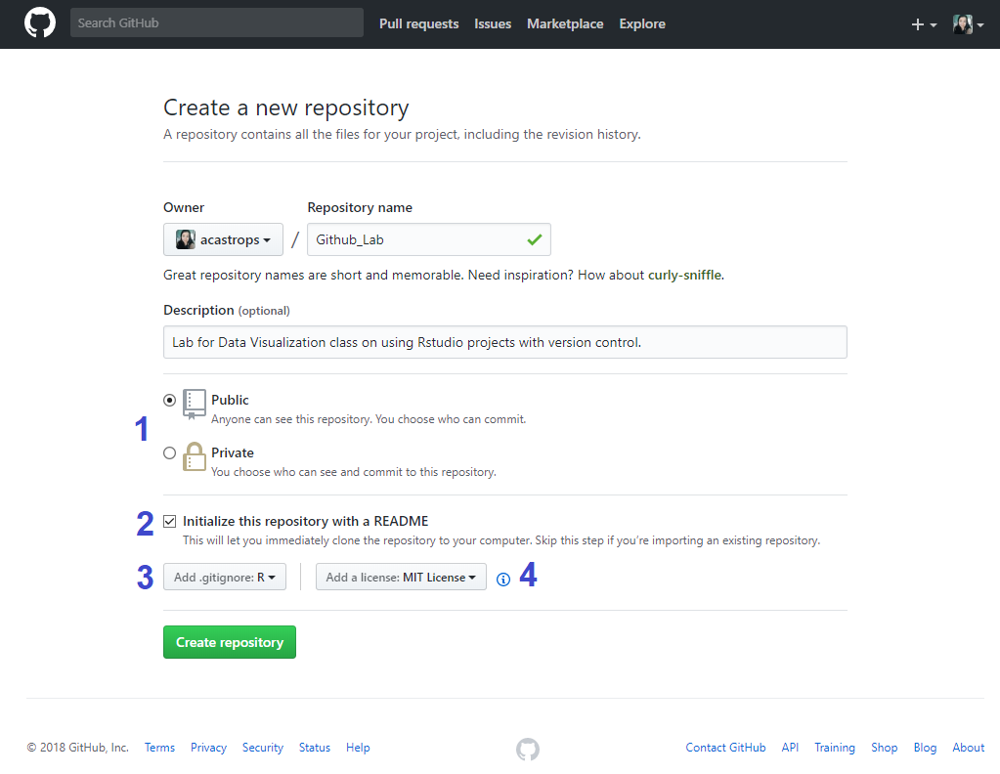

---
title: "GitHub Lab"
author: "Mackenzie Gray, Adriana Souza"
date: "February 8th, 2018"
output:
  html_notebook:
    highlight: tango
    mathjax: null
    number_sections: yes
    theme: spacelab
    toc: yes
    toc_float: yes
---  

  

# What is Git?

Git is a __version control system__. Version control is a system that records changes to a file or set of files
over time so that you can recall specific versions later. 

# Why should I use it?

1. __Version Control__

Imagine you are working on a project and you make a mistake after you've been working on your code for a while. With version control, can rollback your code to a previous version that worked better.

2. __Backup__ 

Your versions are not only stored locally. If you lose your personal computer, you will have a backup of the files you created repositories for.

3. __Sharing and ease of collaboration__

If you need to collaborate on data analysis or code development, then everyone should use Git. Use GitHub as your clearinghouse: individuals work independently, then send work back to GitHub for reconciliation and transmission to the rest of the team.

4. __Exposure:__ 

If someone needs to see your work or if you want them to try out your code, they can easily get it from GitHub. If they use Git, they can clone or fork your repository. If they don’t use Git, they can still browse your project on GitHub like a normal website and even grab everything by downloading a zip archive.

# How can I integrate it into R-studio?

## What you need

1. Having git installed on your machine. If you don't, check out [this guide](https://git-scm.com/book/en/v2/Getting-Started-Installing-Git).

2. Your account to GitHub.
3. RStudio

## Getting started

On your GitHub account, create a new repository and give it a name. 

  

1. __Public vs. Private:__ If you are using a regular free account, your repositories will be public. A good way around this is to use a [GitHub education account](https://education.github.com). 

2. __README:__ Text that will show up when people click your repository. This should be a description of what people can find there and instructions on how to use it, for example.

3. __.gitignore files:__ .gitignore tells git which files (or patterns) it should ignore. It's usually used to avoid committing transient files from your working directory that aren't useful to other collaborators, such as compilation products, temporary files IDEs create, etc. It is also good for passwords and security too. More details [here](https://git-scm.com/docs/gitignore).

4. __License:__ You do not have to use one but, for future reference, the MIT License is a good way to go. The MIT License is a permissive license that is short and to the point. It lets people do anything they want with your code as long as they provide attribution back to you and don’t hold you liable. Need help picking a license? Try [this page](https://choosealicense.com).

### Commit

### Pull

### Push

# Resources

## Videos
+ [Creating RStudio projects from GitHub Repositories](https://www.youtube.com/watch?v=YxZ8J2rqhEM)
+ [RStudio & Github Integration](https://www.youtube.com/watch?v=E2d91v1Twcc)

## Books and Tutorials
+ [Try Git: 15 minute tutorial](https://try.github.io/levels/1/challenges/1)
+ [Happy Git with R](http://happygitwithr.com)
+ [Github with R](https://guides.github.com/activities/hello-world/)
+ [Pro Git](https://www.gitbook.com/book/gitbookio/progit/details)

## Git GUI Clients

Platforms: Windows, Mac, Linux

+ [SourceTree](https://www.sourcetreeapp.com)
+ [GitHub Desktop](https://desktop.github.com)
+ [Git Extensions](https://gitextensions.github.io)
+ [SmartGit](https://www.syntevo.net/smartgit/)
+ [GitKraken](https://support.gitkraken.com/start-here/guide)

## Sites
+ [Github](https://github.com)
+ [RStudio - Version Control with Git and SVN](https://support.rstudio.com/hc/en-us/articles/200532077-Version-Control-with-Git-and-SVN)