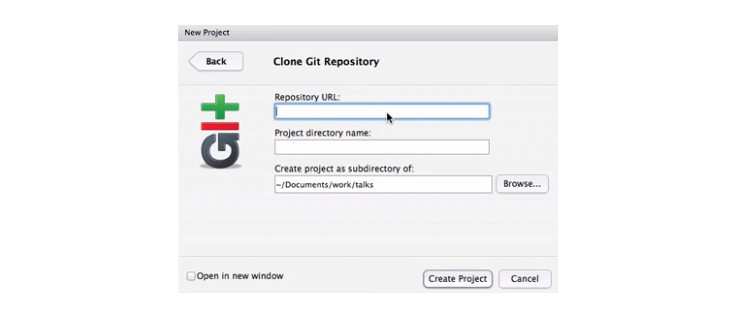
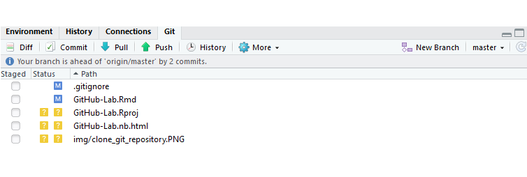
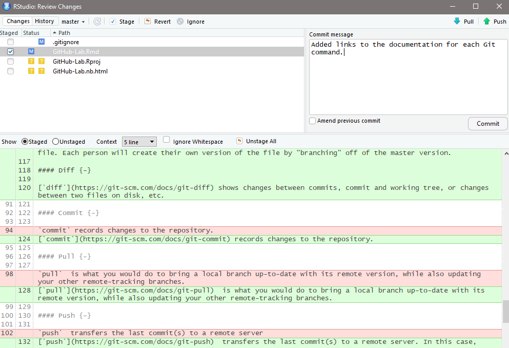
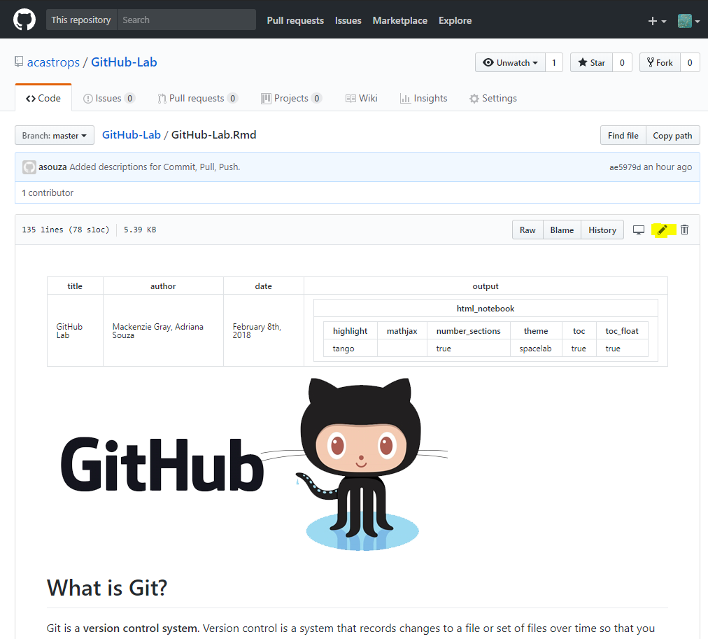
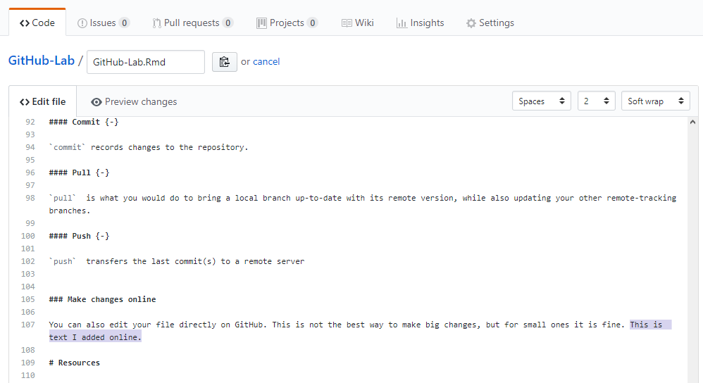
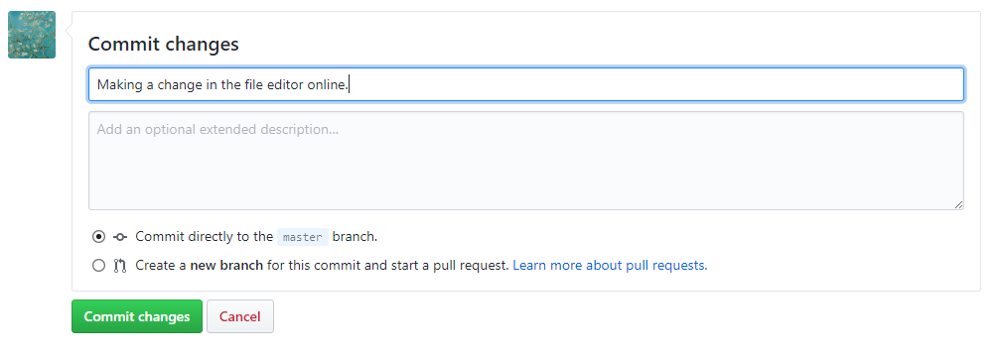
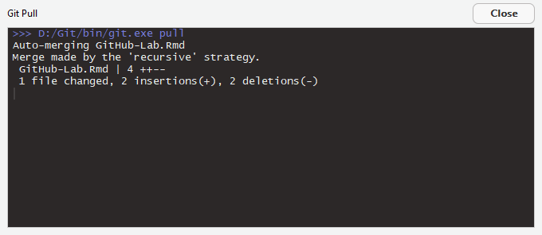
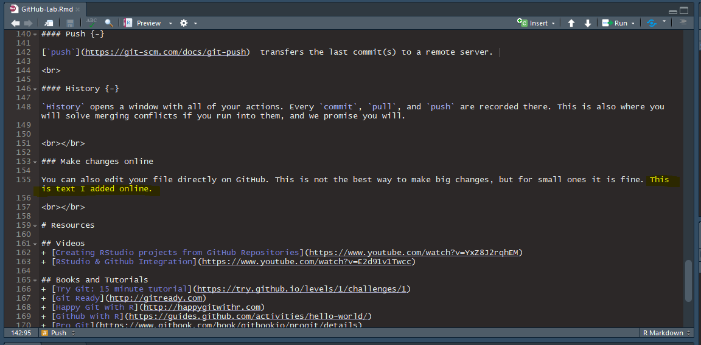

---
title: "GitHub Lab"
author: "Mackenzie Gray, Adriana Souza"
date: "February 8th, 2018"
output:
  html_notebook:
    highlight: tango
    mathjax: null
    number_sections: yes
    theme: spacelab
    toc: yes
    toc_float: yes
---  

  

  

  

# What is Git?

Git is a __version control system__. Version control is a system that records changes to a file or set of files
over time so that you can recall specific versions later. 

  

# Why should I use it?

  

1. __Version Control__

Imagine you are working on a project and you make a mistake after you've been working on your code for a while. With version control, you can rollback your code to a previous version that worked better.

2. __Backup__ 

Your versions are not only stored locally but also remotely. If you lose your personal computer, you will have a backup of the files for which you created repositories.

3. __Sharing and ease of collaboration__

If you need to collaborate on data analysis or code development, then you and your team should use Git. Use GitHub as your clearinghouse: individuals work independently then send work back to GitHub for reconciliation and transmission to the rest of the team.

4. __Exposure:__ 

If someone needs to see your work or if you want them to try out your code, they can easily get it from GitHub. If they use Git, they can clone or fork your repository. If they don’t use Git, they can still browse your project on GitHub like a normal website and even grab everything by downloading a zip archive.

  

# How can I integrate it into R-studio?

What you need:

1. Having git installed on your machine. If you don't, check out [this guide](https://git-scm.com/book/en/v2/Getting-Started-Installing-Git).

2. Your account to GitHub.
3. RStudio

  

## Getting started

### Make a repository 

On your GitHub account, create a new repository and give it a name. 

  

  

1. __Public vs. Private:__ If you are using a regular free account, your repositories will be public. A good way around this is to use a [GitHub education account](https://education.github.com). 

2. __README:__ Text that will show up when people click your repository. This should be a description of what people can find there and instructions on how to use it, for example.

3. __.gitignore files:__ .gitignore tells git which files (or patterns) it should ignore. It's usually used to avoid committing transient files from your working directory that aren't useful to other collaborators, such as compilation products, temporary files IDEs create, etc. It is also good for passwords and security too. More details [here](https://git-scm.com/docs/gitignore).

4. __License:__ You do not have to use one but, for future reference, the MIT License is a good way to go. The MIT License is a permissive license that is short and to the point. It lets people do anything they want with your code as long as they provide attribution back to you and don’t hold you liable. Need help picking a license? Try [this page](https://choosealicense.com).

  

### Make a project in RStudio

1. In RStudio under `File`, click `New Project`. 

2. When prompted, choose the third option down called `Version Control`.

3. Then click the `Git` option.

4. A window will appear that asks you to clone the Git Repository. You can get the url from the big green button that says `Clone or Download` somewhere on the right of your repository page on GitHub. Copy and paste that link in the first field. This should populate the second field according to the repository's name but you can change it to whatever you'd like. You can also change where this will be stored in the third field.

5. You can now create a file for whatever you want to do, or open an existing file you'd like to add, for example.

  

### Make changes: Commit, Pull, Push

When you created your project, a tab called `Git` was added to your `Environment` pane, usually found in the upper right corner of your RStudio window. 

In the `Git` tab, you can see all the files in your project. The `.rmd` file you are editing, the `.proj` file for your project, and here we also see a `.PNG` file for the image that we added to the top of this notebook. These are all the files that will be in your remote repository, but how do we get them there?

For that, take a look at the options `Diff`, `Commit`, `Pull`, `Push`, `History`, `More`, `New Branch` and, in this case, because we created the repository, `master`.

#### New Brach and `master` {-}

The [master branch](https://git-scm.com/book/en/v1/Git-Branching-What-a-Branch-Is) should represent the 'stable' history of your code. When you want to experiment with new features, create a new branch and implement them. When they have matured enough you can merge them back to master. That way code in master will almost always build without problems.

This is also a good way to work in teams, especially when each person is working on separate parts of the same file. Each person will create their own version of the file by "branching" off of the master version.  

 

#### Commit {-}

[`commit`](https://git-scm.com/docs/git-commit) records changes to the repository. You choose the files where you made changes and add a message describing those changes. You do not have to add a message, but you will thank yourself later. 

 

#### Diff {-}

[`diff`](https://git-scm.com/docs/git-diff) shows changes between commits, commit and working tree, or changes between two files on disk, etc. 

 

#### Pull {-}

[`pull`](https://git-scm.com/docs/git-pull) is what you do to bring a local branch up-to-date with its remote version, while also updating your other remote-tracking branches.

 

#### Push {-}

[`push`](https://git-scm.com/docs/git-push)  transfers the last commit(s) to a remote server. 

 

#### History {-}

`History` opens a window with all of your actions. Every `commit`, `pull`, and `push` are recorded there. This is also where you will solve merging conflicts if you run into them, and we promise you will.

  

### Make changes online

You can also edit your file directly on GitHub. Choose what file you want to edit. In this case, we chose the `.Rmd` file for this notebook and we clicked the edit button highlighted below.

 

 

It will bring up a text editor where you can edit your code directly. Here, we added some text to this section and commited that change to the master branch, which is the branch we have been working on.

 

 

Now, go back to RStudio and cick `Pull` under the `Git` tab to merge your local file with the remote one.

 

 

Voila!

 

 

This is not the best way to make big changes because it is easy to run into conflicts but for small ones it's fine. 

 

# Resources

## Videos
+ [Creating RStudio projects from GitHub Repositories](https://www.youtube.com/watch?v=YxZ8J2rqhEM)
+ [RStudio & Github Integration](https://www.youtube.com/watch?v=E2d91v1Twcc)

## Books and Tutorials
+ [Try Git: 15 minute tutorial](https://try.github.io/levels/1/challenges/1)
+ [Git Ready](http://gitready.com)
+ [Happy Git with R](http://happygitwithr.com)
+ [Github with R](https://guides.github.com/activities/hello-world/)
+ [Pro Git](https://www.gitbook.com/book/gitbookio/progit/details)

## Git GUI Clients

Platforms: Windows, Mac, Linux

+ [SourceTree](https://www.sourcetreeapp.com)
+ [GitHub Desktop](https://desktop.github.com)
+ [Git Extensions](https://gitextensions.github.io)
+ [SmartGit](https://www.syntevo.net/smartgit/)
+ [GitKraken](https://support.gitkraken.com/start-here/guide)

## Sites
+ [Github](https://github.com)
+ [RStudio - Version Control with Git and SVN](https://support.rstudio.com/hc/en-us/articles/200532077-Version-Control-with-Git-and-SVN)
